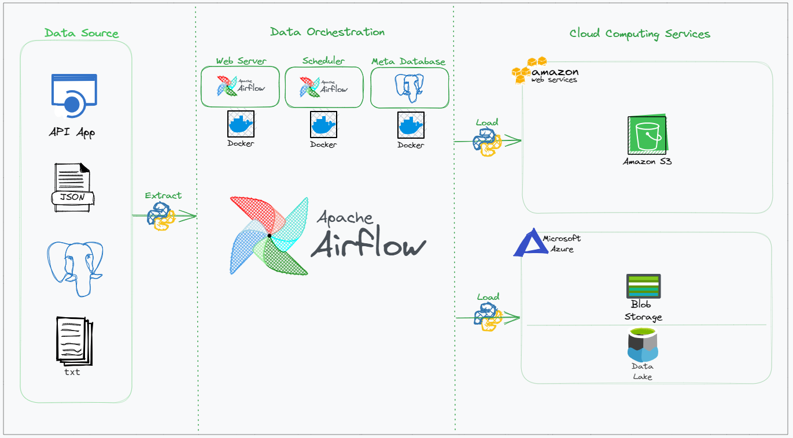
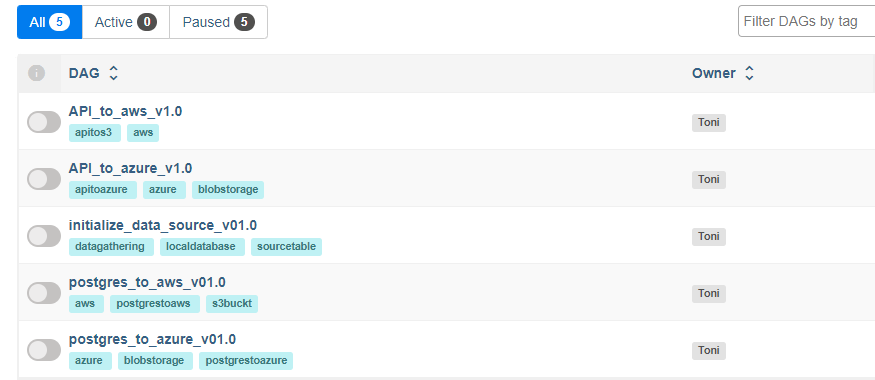
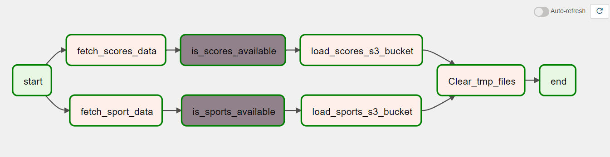
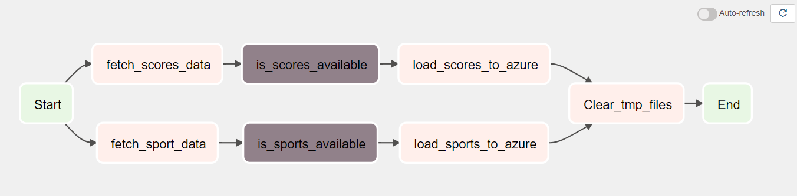
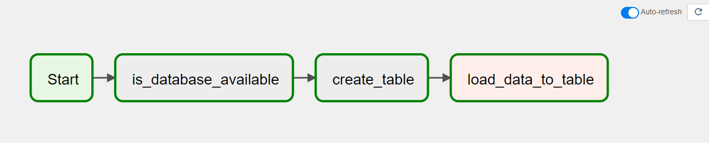
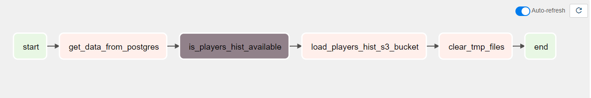
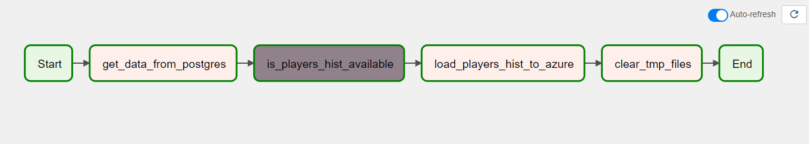
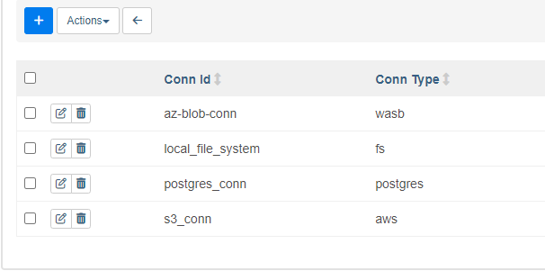

# Data engineering with Airflow

Este projeto é uma adaptação com base em um teste pratico para uma posição de Engenheiro de Dados Jr. Realizado pelo meu amigo Gleison, o projeto original esta neste repositório **[tarefas-engenharia-de-dados](https://github.com/GleisonR/tarefas-engenharia-de-dados)**.

Basicamente desenvolvi um ambiente onde as tarefas solicitadas no teste ganham um ambiente estruturado com as fontes de dados integradas a dois dos principais serviços de cloud que temos atualmente no mercado, Microsoft Azure e AWS. Essa integração é realizada por meio do Apache Airflow tendo como base o processo **ELT**.

Este ambiente é meramente ilustrativo e visa facilitar o entendimento do contexto e dia-a-dia de um ambiente de produção. Neste projeto  realizei apenas a demonstração das etapas **E** (Extract) e **L** (Load) de uma pespectiva onde os dados precisam ser extraidos de suas fontes e depositados em um data lake, mais especificamente na camada **Raw** ou **Landing**, as nomeclaturas vão depender de qual arquitetura de dados cada empresa usa. *(Caso tenha interesse em ver as transformações que deve ser realizadas vá ao repositório original do projeto **[tarefas-engenharia-de-dados](https://github.com/GleisonR/tarefas-engenharia-de-dados)**)*

> **Note**
> Este projeto não se trata da estruturação de um data lake ou de como uma arquitetura deve ser estruturada, ele visa somente materializar um conceito da forma mais simples possivel.

## Acesso aos dados da API

- Para usar as dags da API é preciso se resgistar para obter a chave de autenticação
- Depois de obter sua chave coloque neste campo ``API_KEY=sua_chave_aqui`` do arquivo ``.env``
- Site da API: https://rapidapi.com/theoddsapi/api/live-sports-odds
- Obs: todas as passwords no arquivo .env_template são Dummy. Nunca exponha seu .env


## Porque Airflow para esse teste?

- De longe é um dos mais acessiveis para praticar E.D com python e montar um ambiente de treinamento.

## Como usar

- Baixe o projeto

```sh
git clone https://github.com/ac-gomes/data_engineer_with_airflow
```

- Acesse a pasta raiz

```sh
cd data_engineer_with_airflow
```

- Crie um ambiente virtual do Python3

```sh
 python3 -m venv env
```

- Ative seu ambiente virtual

```sh
 source env/bin/activate
```

- Crie as pastas do Airflow

```sh
mkdir -p ./dags ./logs ./plugins ./config ./data
```

- Extraia o user id do Airflow para o arquivo de variavel de ambiente (.env)

```sh
###################################################################################
##### Esse id será salvo no arquivo .env
##### Atualmente ele está no repositório como .env_template renomeie para .env antes do comando abaixo

echo -e "AIRFLOW_UID=$(id -u)" >> .env

```

- Inicialize o banco de dados de MetaDados

```sh
docker compose up airflow-init
```

- Inicialize o Airflow

```sh
docker compose up -d
```

> **Note**
> Com seu ``env`` ativo instale o Airflow 2.6.1
> E as dependencias do arquivo ``requirements.txt``

## Estendendo a imagem do Docker

- Execute o comando

```sh
### este comando irá instalar os pacotes do arquivo 'requirements.txt' no container do Airflow
### conforme os parametros no Dockerfile

docker build . --tag extending_airflow:latest
```

- Recriar os conteiners do Airflow

```sh
### este comando irá recriar os containers do Airflow (airflow-webserver e airflow-scheduler)
### já com as novas dependencias instaladas

docker compose up -d --no-deps --build airflow-webserver airflow-scheduler
```

## Criar banco de dados para receber os dados do desafio

- Execute o comando

```sh
## criar banco de dados 'src_db'
python3  dags/sports/database/init_database.py
```

> **Warning**
> **DISCLAIMER**
> O banco de dados ``src_db`` será criado na instancia do Postgres usado como 'Meta Database'
> pelo Airflow isso não é recomendado em nem uma circunstância em prd, dev, ou qa.
> Neste ambiente foi feito isso para simpificar a ilustração e o ambiente onde foi feito o projeto
> é o WSL2.

## Estrutura do Projeto



## Estrutura de Diretórios

```sql
├── config
├── dags
│   ├── common
│   │   ├── config
│   │   │   ├── __init__.py
│   │   │   └── odds_api.py
│   │   └── scripts
│   │       ├── __init__.py
│   │       ├── file_manager.py
│   │       ├── load_to_aws.py
│   │       ├── load_to_azure.py
│   │       └── utils.py
│   └── sports
│       ├── dag_api_to_aws.py
│       ├── dag_api_to_azure.py
│       ├── dag_initialize_data_source.py
│       ├── dag_postgres_to_aws.py
│       ├── dag_postgres_to_azure.py
│       ├── database
│       │   ├── __init__.py
│       │   ├── api_connection.py
│       │   ├── db_connection.py
│       │   └── init_database.py
│       ├── includes
│       │   └── db_data.csv
│       └── services
│           ├── get_data_api.py
│           └── get_data_db.py
├── data
├── docker-compose.yaml
├── plugins
├── requirements.txt
├── Dockerfile
├── README.md
```

## Tarefas simuladas no projeto



## Fluxos de execução de cada tarefa

### API_to_aws_v1.0



### API_to_azure_v1.0



### Initialize_data_source_v01.0



### Postgres_to_aws_v01.0



### Postgres_to_azure_v01.0



## Conexões projeto



## Ambiente de Desenvolvimento

```
> wsl -l -v
  NAME            STATE           VERSION
* Ubuntu-20.04    Running         2
```

```sh
» airflow version

2.6.1

» docker version

Client: Docker Engine - Community
 Version:           23.0.1
 API version:       1.42
 Go version:        go1.19.5
 Git commit:        a5ee5b1
 Built:             Thu Feb  9 19:46:56 2023
 OS/Arch:           linux/amd64
 Context:           default

```

## Ponto inicial do Projeto

Arquivo yaml localizado na página oficial do airflow neste [link stable docker-compose](https://airflow.apache.org/docs/apache-airflow/stable/howto/docker-compose/index.html)

> **Note**
>
> Para mais detalhes sobre airflow consulte sempre a [documentação oficial](https://airflow.apache.org/docs/)
>

# Enjoy!